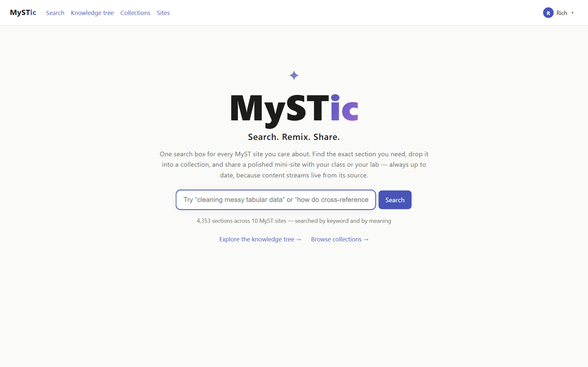
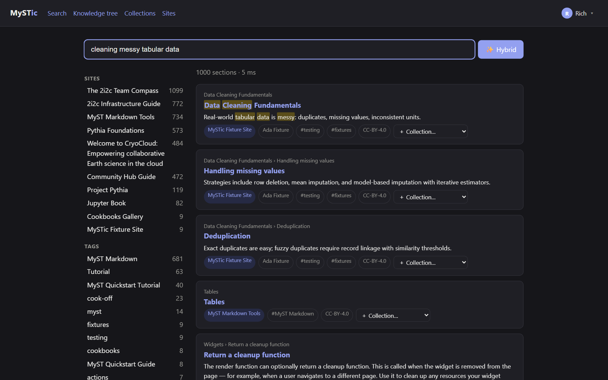
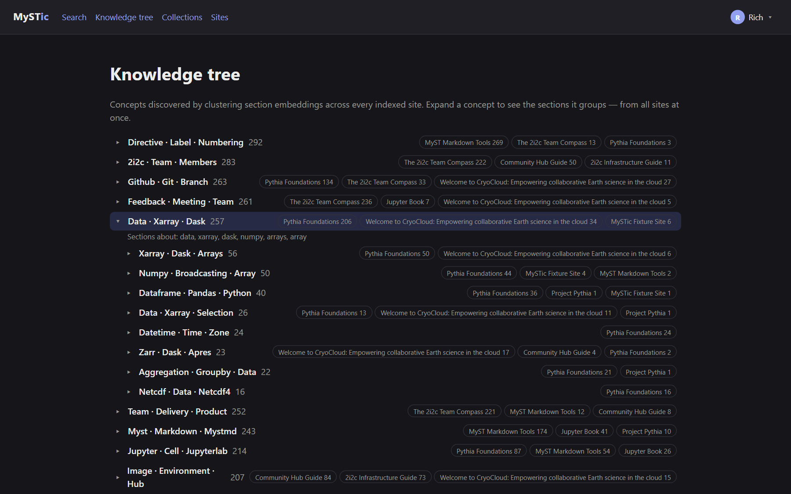
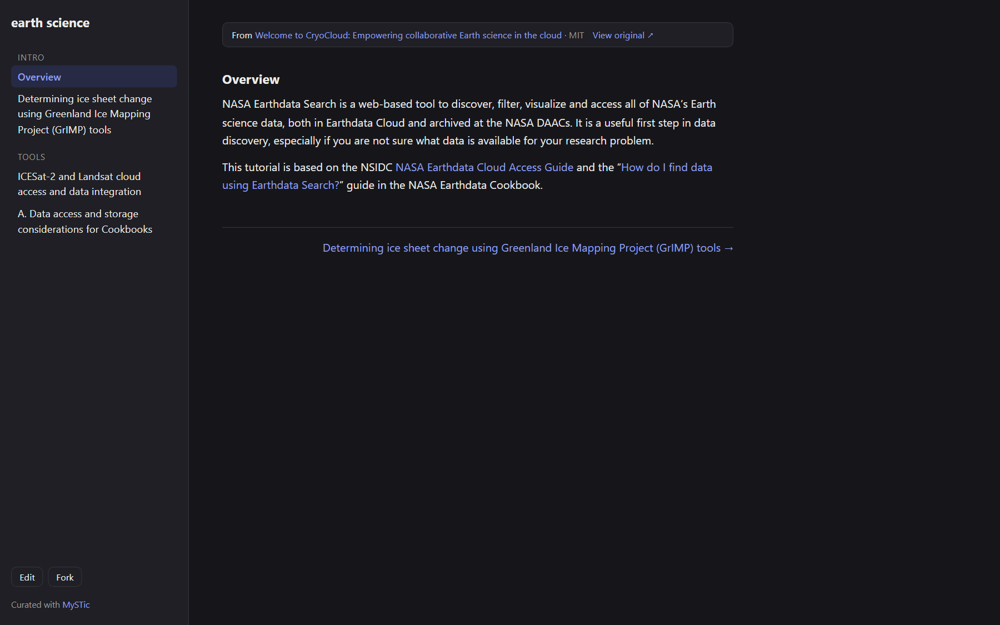
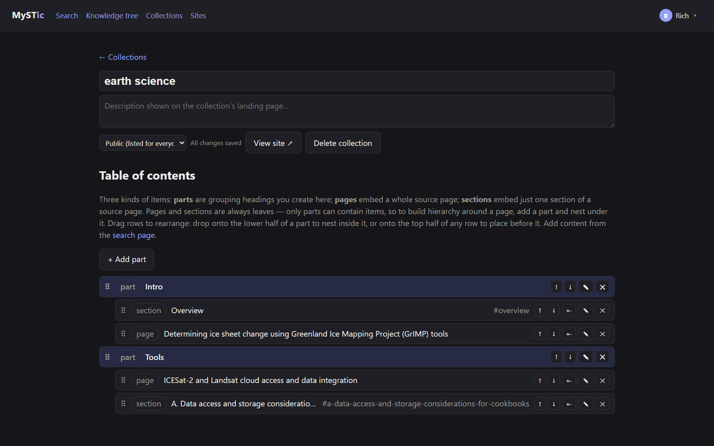

# MySTic ✦

**Search. Remix. Share.**

One search box for every [MyST](https://mystmd.org) site you care about. Find the exact section you need, drop it into a collection, and share a polished mini-site with your class or your lab — always up to date, because content streams live from its source.

MySTic is a self-hosted search and curation engine for the MyST ecosystem, built for researchers and educators. It crawls MyST sites through their structured JSON (no HTML scraping), indexes every *section* for keyword **and** semantic search, maps concepts across communities into a knowledge tree, and lets anyone weave sections from many sites into cohesive, live-updating collections.



## Features

- **Federated search** — Meilisearch hybrid search (keyword + local embeddings) at section granularity across every indexed site, with facets and MyST-style hover previews of live content.
- **Knowledge tree** — a cross-site concept map built by clustering section embeddings; labels via TF-IDF, or Claude-written when an Anthropic API key is configured.
- **Collections** — curate pages and sections into mini-MyST sites (`/c/<slug>`) with custom names, descriptions, and drag-and-drop tables of contents, presented as a table of contents or as a **tag-filterable gallery** of cards (thumbnails, authors and tags come from the source sites' frontmatter). Layout is set per **part** as well as per collection, so one collection can read as an ordered sequence where that helps and browse as a gallery where it does not. Content is embedded **by reference** and fetched live from the source (with a short cache and an offline fallback), so upstream edits appear without recrawling. Every page carries a source-attribution banner with authors and license.
- **Sharing** — collections are public, unlisted, or private; any viewable collection can be forked. Users can enable a public profile at `/u/<handle>` listing their public collections.
- **Accounts & admin** — email/password accounts (scrypt-hashed) and optional **GitHub sign-in**; password change plus **recovery codes** (shown once at registration, rotatable from Account settings) for email-free password resets — no mail server required. The first account registered becomes the instance administrator and can manage sites, users (including issuing recovery codes), and instance settings (recrawl interval, cache TTL, AI labeling on/off, registration open/closed, OAuth).
- **Feeds other MyST sites** — every collection is *also* served as a MyST site (`myst.xref.json` + per-item JSON at `<api>/api/c/<slug>`), so any MyST tool can consume it — MySTic's own crawler included. And the [`{mystic}` directive](packages/myst-plugin/README.md) drops a section from any indexed site straight into **your** MyST build, with attribution attached.
- **Local-first AI** — embeddings run locally (bge-small via transformers.js); the only optional external AI call is concept labeling, and local mode is the default whenever no API key is configured.

## Screenshots

| Hybrid search with live hover previews | Knowledge tree |
| --- | --- |
|  |  |

| A collection page, embedded live with attribution | The drag-and-drop TOC editor |
| --- | --- |
|  |  |

## Requirements

- [Node.js](https://nodejs.org) **20 or newer** (22 recommended)
- ~2 GB free disk (dependencies, the Meilisearch binary, the search index, and the embedding model)
- macOS, Linux, or Windows. No Docker required for local use.

## Installation

```bash
git clone https://github.com/Gman0909/MySTic.git
cd MySTic
npm install -g pnpm@9   # skip if you have pnpm already
pnpm setup
```

`pnpm setup` installs workspace dependencies, downloads the Meilisearch binary into `.meili/`, and creates a default `.env` from `.env.example`.

## Running

| Command | What it does |
| --- | --- |
| `pnpm start` | Starts Meilisearch, the API (`:4000`), and the web app (`:3000`) in the background; logs to `.data/logs/` |
| `pnpm stop` | Stops everything `pnpm start` launched |
| `pnpm run update` | `git pull` + dependency refresh (restart after updating). Note the `run` — a bare `pnpm update` invokes pnpm's own dependency updater instead |
| `pnpm setup` | First-time install (safe to re-run) |

Then open **http://localhost:3000**.

### First run

1. On first boot the API imports the bundled site list (`seed/sites.json` — the MyST guide, Jupyter Book, 2i2c docs, Project Pythia, CryoCloud, …) and starts crawling and embedding it. **Allow 10–20 minutes** for the full index and knowledge tree to build; search works progressively as sites finish. The embedding model (~34 MB) downloads automatically on the first crawl.
2. **Register an account — the first account becomes the administrator.**
3. Optionally visit **Admin** to add your own MyST sites, tune settings, or paste an Anthropic API key for nicer knowledge-tree labels.

### What counts as a MyST site?

Any site built with [mystmd](https://mystmd.org) (including Jupyter Book 2) — MySTic reads the site's `myst.xref.json` and per-page JSON ASTs. Legacy Sphinx/Jupyter-Book-1 sites don't expose this API and can't be indexed yet; the admin form will tell you when a URL isn't a MyST site.

## Instance settings (Admin → Instance settings)

| Setting | Default | Notes |
| --- | --- | --- |
| Recrawl every | 24 h | Scheduler refreshes each site; **minimum 6 h** to stay polite to upstream servers |
| Live-content cache | 5 min | How long collection pages/previews cache upstream content; minimum 1 min |
| Crawl concurrency | 4 | Parallel page fetches per site (1–8) |
| AI concept labeling | on | Off = fully local mode: TF-IDF labels, zero external AI calls |
| Anthropic API key | — | Stored server-side, never echoed to clients; enables Claude-written concept labels |
| Open registration | on | Turn off to close the instance once your team has joined |

## Architecture

pnpm + Turborepo monorepo:

| Path | What |
| --- | --- |
| `apps/api` | Fastify REST API, crawl/index/ontology job runner, auth |
| `apps/web` | Next.js UI — hero, search, knowledge tree, collections, admin |
| `packages/core` | Shared types, zod schemas, MyST AST utilities |
| `packages/crawler` | MyST site discovery, polite AST fetching, section extraction |
| `packages/ontology` | Local embeddings (transformers.js), k-means clustering, labeling |
| `packages/myst-plugin` | mystmd plugin: the `{mystic}` directive, for embedding into other MyST sites |

Storage: **PGlite** (embedded Postgres + pgvector, in `.data/pglite/` — zero setup) and **Meilisearch** (binary in `.meili/`). For a real deployment see **[DEPLOYMENT.md](DEPLOYMENT.md)** — Netlify-hosted frontend + a docker-compose backend stack (`deploy/backend/`) behind Caddy with automatic HTTPS.

Container images are **built, smoke-tested (health + registration + search against real Postgres/Meilisearch), and published by CI** on every push to main: `ghcr.io/gman0909/mystic-api` and `ghcr.io/gman0909/mystic-web` (`:latest` or a commit SHA). Note the web image bakes `NEXT_PUBLIC_API_URL` at build time — rebuild it with your own API URL for a real deployment.

### Using MySTic from your own MyST site

MySTic is a destination — a search engine and a place to publish collections — but it is also infrastructure other MyST sites can build on. Two ways in:

**Embed a section into your own build.** Copy `packages/myst-plugin/mystic.mjs` into your project, list it under `project.plugins` in `myst.yml`, and point the directive at any page or section of a site your instance indexes:

```markdown
:::{mystic} https://foundations.projectpythia.org/core.xarray.xarray-intro#introducing-the-dataarray-and-dataset
:api: https://mystic.example
:::
```

The section is fetched at build time and spliced into your page, followed by an attribution line. If the instance is unreachable or the anchor no longer exists, the build warns rather than fails. See the [plugin README](packages/myst-plugin/README.md).

**Consume a whole collection as a site.** Any public or unlisted collection is served in MyST's own format at `<api>/api/c/<slug>` — `myst.xref.json` plus one JSON document per item, with attribution prepended to each. Point any MyST tool at that URL, or register it in another MySTic instance to index a curated collection like any other site.

Both surfaces flatten notebook outputs into plain mdast (images, code blocks) before handing them over, because a built site's outputs are already minified and cannot be fed back into another mystmd build as-is.

### Privacy & data layout

Everything user-generated lives in `.data/` (accounts, sessions, collections, the API key setting) and `.meili/` (search index) — both are `.gitignore`d and never leave your machine. The repo ships only code and the public seed list.

## Development

```bash
pnpm meili                       # terminal 1: Meilisearch
cd apps/api && pnpm dev          # terminal 2: API with reload
cd apps/web && pnpm dev          # terminal 3: web with reload
pnpm -r exec tsc --noEmit        # typecheck everything
```

Useful API endpoints: `GET /api/search?q=…&mode=hybrid|keyword`, `GET /api/tree`, `POST /api/sites` (admin), `POST /api/sites/:id/crawl?force=true` (admin), `POST /api/ontology/rebuild` (admin), `GET /api/content/:siteId/<slug>` (live AST).

A tiny deterministic MyST site for testing lives in `fixtures/mystsite` (build with `../../node_modules/.bin/myst build --html` from that directory, serve with `node scripts/serve-fixture.mjs`).

End-to-end checks against a running instance live in `scripts/verify.mjs`: it renders every item of every public collection (catching runtime errors and blank pages), confirms the source links MySTic builds actually resolve, and exercises the API error paths. Run `node scripts/verify.mjs`; set `MYSTIC_TOKEN` to include the access-control checks, and pass `--deep` to also report link rot inside the source content. Needs `pnpm exec playwright install chromium` once.

README screenshots regenerate with `node scripts/screenshots.mjs` against a running instance (`pnpm exec playwright install chromium` once first; set `MYSTIC_TOKEN` for the signed-in shots).

## Troubleshooting

- **Port in use** — MySTic uses 3000 (web), 4000 (API), 7700 (Meilisearch). Change them in `.env`.
- **First search results look thin** — the seed crawl is still running; watch `.data/logs/api.log`.
- **`memory access out of bounds` in api.log** — PGlite's WASM heap was exhausted; restart with `pnpm stop && pnpm start`. Data on disk is safe.
- **Registration disabled** — an admin turned off open registration (Admin → Instance settings).
- **Reset everything** — stop MySTic and delete `.data/` and `.meili/data` (this deletes accounts and collections; the seed list re-imports on next start).

## Roadmap

API rate limiting · deeper collection nesting · HTML-fallback crawler for non-mystmd sites.

---

Built with [mystmd](https://mystmd.org)'s open content APIs. Collections embed upstream content by reference with attribution and license surfaced — please curate responsibly.
